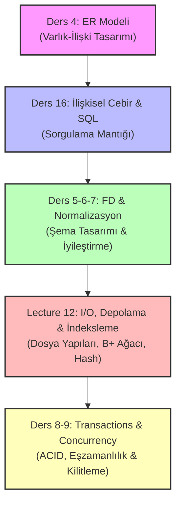

# 📚 Veritabanı Yönetim Sistemleri (VTYS) Kapsamlı Sınav Çalışma Rehberi

Bu çalışma rehberi, veritabanı yönetim sistemleri dersinizin final sınavı müfredatındaki tüm konuları (**ER Modeli, İlişkisel Cebir, SQL, Normalizasyon, Depolama/İndeksleme ve Transactions/Concurrency**) kapsayacak şekilde, geçmiş sınav soruları ve ders notları analiz edilerek **genişletilmiş ve eksiksiz hale getirilmiştir**.

---

## 🗺️ Genel Yol Haritası

---

## 🎨 1. Ders 4: Varlık-İlişki (ER) Modeli ve Şema Eşleme

ER Modeli kavramsal bir tasarım aracıdır. Tasarım tamamlandıktan sonra mantıksal tablolara (İlişkisel Şema) dönüştürülür.

### Temel ER Kavramları
1. **Varlık Seti (Entity Set):** Benzersiz nesnelerin kümesidir (Örn: `Öğrenci`, `Kurs`). ER diyagramlarında **dikdörtgen** ile gösterilir.
2. **Öznitelik (Attribute):** Varlıkların özellikleridir. **Elips** ile gösterilir.
   * **Birincil Anahtar (Primary Key):** Varlığı benzersiz tanımlar, altı çizilidir. *Asla NULL değer alamaz!*
   * **Çok Değerli (Multi-valued):** Birden fazla değer alabilir (Örn: `Telefonlar`). **Çift elips** ile gösterilir.
   * **Bileşik (Composite):** Alt alanlara ayrılabilir (Örn: `Adres` ➔ `İl`, `İlçe`, `Sokak`).
   * **Türetilmiş (Derived):** Diğer özniteliklerden hesaplanır (Örn: `Doğum Tarihi`'nden türetilen `Yaş`). **Kesikli elips** ile gösterilir.
3. **Zayıf Varlık (Weak Entity):** Kendine ait bir birincil anahtarı yoktur, var olmak için bir sahibe (identifying owner) ihtiyaç duyar. **Çift çizgili dikdörtgen** ile gösterilir. Anahtarı kesikli çizgiyle belirtilen bir kısmi anahtardır (discriminator).
4. **İlişki Seti (Relationship Set):** Varlıklar arasındaki bağdır. **Eşkenar dörtgen (baklava)** ile gösterilir.

### Katılım ve Kardinalite Kısıtları
* **Kardinalite (1:1, 1:N, M:N):** Bir varlığın karşı taraftan en fazla kaç varlıkla eşleşebileceğini gösterir.
* **Katılım Kısıtı (Participation Constraint):**
  * **Kısmi Katılım (Partial - Tek Çizgi):** Varlığın ilişkide bulunma zorunluluğu yoktur.
  * **Tam Katılım (Total - Çift Çizgi):** Her varlık ilişkide yer almalıdır (Örn: Her `Bölüm`'ün mutlaka bir `Yönetici`'si olmalıdır).

### ER'dan İlişkisel Şemaya Dönüşüm Kuralları
* **Güçlü Varlıklar:** Doğrudan tabloya dönüşür.
* **Zayıf Varlıklar:** Tabloya dönüştürülürken, sahibinin birincil anahtarı zayıf varlığın kısmi anahtarı ile birleştirilerek **Bileşik Birincil Anahtar (Composite PK)** oluşturulur.
* **M:N İlişkiler:** İlişki adı altında yeni bir tablo oluşturulur. Tablonun PK'si, bağlanan iki varlığın PK'lerinin bileşimidir.
* **Çok Değerli Öznitelikler:** Kendine ait ayrı bir tabloya dönüştürülür (Örn: `Ogrenci_Telefonlar(ogrenci_id, telefon)`).

### 🧬 Alt Sınıflar (Subclasses - ISA Relationships) ve Şema Eşleme
ER diyagramlarında alt sınıflar bir **ISA (is-a)** üçgeni ile gösterilir (Örn: `YazılımÜrünü` ISA `Ürün`). Alt sınıfları tablolara dönüştürmek için 3 farklı strateji kullanılır:
1. **ER Tarzı (E/R Style):** Her alt sınıf ve üst sınıf için ayrı bir tablo oluşturulur. Alt sınıfın birincil anahtarı, üst sınıfın birincil anahtarıdır ve üst sınıfa referans veren bir yabancı anahtardır (Foreign Key).
   * *Örn:* `Urun(urun_id, ad, fiyat)` ve `YazilimUrunu(urun_id, platform)`
2. **Nesne Yönelimli Tarz (OO Style):** Üst sınıf soyut ise, sadece alt sınıflar için tablolar oluşturulur. Alt sınıf tabloları, üst sınıfın tüm ortak kolonlarını da içerir.
   * *Örn:* `YazilimUrunu(urun_id, ad, fiyat, platform)` ve `EgitimUrunu(urun_id, ad, fiyat, yas_grubu)` (Urun tablosu oluşturulmaz).
3. **Tek Tablo / NULL Değer Tarzı (Single Table Style):** Tek bir büyük tablo oluşturulur. Bu tablo üst sınıf ve tüm alt sınıfların kolonlarını içerir. Alt sınıflara özel kolonlar boş (NULL) değer alabilir. Hangi satırın hangi sınıfa ait olduğunu belirten bir `tip` kolonu eklenir.
   * *Örn:* `Urun(urun_id, ad, fiyat, platform, yas_grubu, urun_tipi)`

---

## 🧮 2. Lecture 16: İlişkisel Cebir (Relational Algebra)

İlişkisel Cebir, ilişkisel veritabanı sorgularının matematiksel arka planıdır. Küme tabanlıdır.

| Operatör | İsmi | Görevi | SQL Karşılığı |
| :--- | :--- | :--- | :--- |
| $\sigma_{koşul}(R)$ | Seçim (Selection) | Koşula uyan **satırları** filtreler | `WHERE` |
| $\pi_{A_1,..,A_n}(R)$ | İzdüşüm (Projection) | Belirli **sütunları** seçer | `SELECT` |
| $\rho_{S}(R)$ | Yeniden Adlandırma (Rename) | Tabloyu veya alanları yeniden adlandırır | `AS` |
| $R \times S$ | Kartezyen Çarpım | İki tablonun tüm kombinasyonlarını birleştirir | `FROM R, S` |
| $R \bowtie_{\theta} S$ | Theta Join | Belirli bir $\theta$ koşuluna göre birleştirir | `JOIN ON koşul` |
| $R \bowtie S$ | Doğal Birleştirme (Natural Join) | Ortak ada sahip nitelikleri otomatik eşler | `NATURAL JOIN` |
| $R \cup S$ | Birleşim (Union) | İki kümenin tüm elemanlarını birleştirir | `UNION` |
| $R \cap S$ | Kesişim (Intersection) | İki kümenin ortak elemanlarını bulur | `INTERSECT` |
| $R - S$ | Fark (Difference) | R'de olup S'de olmayanları getirir | `EXCEPT` |
| $R / S$ | Bölme (Division) | S'deki tüm değerlerle eşleşen R değerlerini bulur | Çift `NOT EXISTS` |

> [!WARNING]
> **Önemli Yazım Kuralı (Sınav Sorusu):** Bir ilişkisel cebir ifadesinde **operatör parametreleri / koşullar / alan isimleri** alta simge (subscript) olarak yazılırken (Örn: $\sigma_{yas > 20}$), **tablo isimleri** ise parantez içinde belirtilir (Örn: $(Student)$).

---

## 🗃️ 3. Ders 2-3 & SQL: Gelişmiş SQL Sorguları ve NULL Mantığı

Sınavlarda SQL sorgularının yazım kuralları, alt sorgular ve NULL değerlerin davranışları sıkça sorulmaktadır.

### 💡 SQL Üç Değerli Mantık (Three-Valued Logic) ve NULL Davranışı
SQL'de `NULL` "bilinmeyen değer" anlamına gelir ve mantıksal karşılaştırmalarda 3 değerli mantık (True, False, Unknown) geçerlidir:
* **Karşılaştırmalar:** `NULL = NULL` ifadesi **UNKNOWN** (bilinmeyen) değerini döndürür, `True` veya `False` değil! Bir alanın NULL olup olmadığını kontrol etmek için yalnızca `IS NULL` veya `IS NOT NULL` kullanılmalıdır.
* **AND / OR Tablosu:**
  * `TRUE AND UNKNOWN` ➔ **UNKNOWN**
  * `FALSE AND UNKNOWN` ➔ **FALSE**
  * `TRUE OR UNKNOWN` ➔ **TRUE**
  * `FALSE OR UNKNOWN` ➔ **UNKNOWN**
  * `NOT UNKNOWN` ➔ **UNKNOWN**
* **Aggregate (Kümeleme) Fonksiyonlarında NULL:**
  * `COUNT(*)` satır sayısını saydığı için **NULL içeren satırları da sayar**.
  * `COUNT(kolon_adi)`, `AVG(kolon_adi)`, `SUM(kolon_adi)` gibi fonksiyonlar **NULL değerleri tamamen yok sayar (ignore)**. Eğer tüm satırlar NULL ise `SUM` ve `AVG` sonucu NULL döner, `COUNT` ise 0 döner.

### ⛓️ Set (Küme) Operatörleri ve ANY / ALL
* **UNION / INTERSECT / EXCEPT:** SQL'de bu operatörler varsayılan olarak **tekrar eden satırları eler (DISTINCT)**. Eğer tekrar eden satırların korunması isteniyorsa `UNION ALL`, `INTERSECT ALL`, `EXCEPT ALL` kullanılmalıdır.
* **ANY (veya SOME):** Alt sorgudan dönen değerlerden **en az biri** koşulu sağlıyorsa True döner.
  * *Örn:* `yas > ANY (SELECT yas FROM ogrenci)` ➔ En genç öğrenciden daha yaşlı olanları getirir. (Öğrencilerin yaşlarından en az birinden büyük olması yeterlidir).
* **ALL:** Alt sorgudan dönen değerlerin **tamamı** koşulu sağlıyorsa True döner.
  * *Örn:* `yas > ALL (SELECT yas FROM ogrenci)` ➔ En yaşlı öğrenciden de yaşlı olanları getirir. (Tüm öğrencilerin yaşlarından büyük olmak zorundadır).

---

## 🧬 4. Ders 5-6-7: Fonksiyonel Bağımlılıklar ve Normalizasyon

Fonksiyonel Bağımlılıklar ($X \rightarrow Y$), veritabanında gereksiz veri tekrarını (redundancy) ve güncelleme anomalilerini önlemek için kullanılan kurallardır.

### Kapanış Hesaplama (Attribute Closure - $X^+$)
Bir nitelik kümesinin belirleyebileceği tüm nitelikleri bulma algoritmasıdır:
1. $X^+ = X$ olarak başlatılır.
2. Herhangi bir $U \rightarrow V$ bağımlılığı için $U \subseteq X^+$ ise, $X^+ = X^+ \cup V$ yapılır.
3. Değişiklik olmayana kadar adım 2 tekrarlanır.
* **Süper Anahtar:** $X^+ = \text{Tüm Nitelikler}$ ise $X$ bir süper anahtardır.
* **Aday Anahtar:** Minimal süper anahtardır (hiçbir alt kümesi süper anahtar olamaz).

### Normal Formlar (Özet Tablo)

| Normal Form | Koşul | Açıklama |
| :---: | :--- | :--- |
| **1NF** | Atomik Değerler | Kolonlar çoklu değer veya liste içeremez. |
| **2NF** | Kısmi Bağımlılık Yok | Birincil olmayan hiçbir özellik, bir aday anahtarın alt kümesine bağımlı olamaz (Anahtar tek kolonluysa otomatik sağlanır). |
| **3NF** | Geçişli Bağımlılık Yok | Her $X \rightarrow Y$ için; ya $X$ bir süper anahtardır ya da $Y$ bir birincil (prime) niteliktir. |
| **BCNF** | Güçlü 3NF | Her $X \rightarrow Y$ için; $X$ mutlaka bir süper anahtar olmak zorundadır. |

### Kayıpsız Birleşme (Lossless-Join Decomposition)
Bir $R$ ilişkisi $R_1$ ve $R_2$ olarak ayrıştırıldığında, verinin kaybolmaması veya hayalet satır oluşmaması için:
$$(R_1 \cap R_2) \rightarrow R_1 \quad \text{veya} \quad (R_1 \cap R_2) \rightarrow R_2$$
bağımlılığı $F^+$ içinde yer almalıdır. Yani, iki tablonun ortak kolonları, tablolardan en az birinin anahtarı olmalıdır.

### 📐 BCNF Ayrıştırma (Decomposition) Algoritması
Bir $R$ ilişkisi BCNF'de değilse, BCNF'yi ihlal eden bir $X \rightarrow Y$ bağımlılığı ($X$ süper anahtar değildir) üzerinden şu adımlarla parçalanır:
1. $R$ tablosu ikiye bölünür:
   * $R_1 = X \cup Y$ (yani $X$ ve onun belirlediği tüm nitelikler, $X^+$)
   * $R_2 = R - Y$ (yani $X$ ve $X$'in doğrudan belirlemediği diğer tüm nitelikler)
2. Elde edilen $R_1$ ve $R_2$ şemaları üzerinde bağımlılıklar yeniden kontrol edilir.
3. BCNF'de olmayan alt tablolar varsa, adımlar onlar için de tekrarlanır (Özyinelemeli / Recursive).
* **Önemli Not:** BCNF parçalaması her zaman **kayıpsızdır (lossless)** ancak her zaman **bağımlılıkları koruyan (dependency preserving)** olmayabilir.

---

## 💾 5. Lecture 12: Depolama, G/Ç (I/O) ve İndeksleme

Veritabanı motorunun diskten veri okuma/yazma maliyetlerini yönetme şeklidir.

### Bellek Hiyerarşisi ve Buffer Pool
* **Disk I/O:** En yavaş ve pahalı işlemdir. VTYS performansı, disk okuma sayısını en aza indirmekle ölçülür.
* **Buffer Manager:** Disk sayfalarını (pages) RAM'de tutar.
  * **Pin Count:** Sayfayı o an kaç işlemin kullandığını belirtir. Sıfır olmadan sayfa diskten atılamaz.
  * **Dirty Bit:** Sayfadaki verinin RAM'de güncellenip güncellenmediğini belirtir. Güncellendiyse diskten atılmadan önce diske geri yazılması (flush) gerekir.
  * **Sayfa Değiştirme Politikaları:** LRU (Least Recently Used), Clock, MRU.

### İndeksleme: B+ Ağacı vs. Hash İndeksi
* **Hash İndeksi:** Sadece **eşitlik** aramalarında ($c = 8$) mükemmeldir ($O(1)$). Aralık aramalarını ($c > 8$) desteklemez.
* **B+ Tree İndeksi:** Hem eşitlik hem de **aralık** aramalarında ($c > 8$) çok başarılıdır. Yaprak düğümleri (leaf nodes) birbirine çift yönlü bağlı liste ile bağlı olduğu için sıralı erişim çok hızlıdır.

### ⚙️ Dış Bellek Sıralama (External Merge Sort) Maliyet Analizi
Ana bellek (RAM) kapasitesini aşan büyüklükteki dosyaları sıralamak için kullanılan algoritmadır. 
$N$ sayfa sayısı ve $B$ kullanılabilir buffer (RAM) sayfa sayısı olmak üzere maliyet şu şekilde hesaplanır:
1. **Pass 0 (İlk Sıralı Parçaları Oluşturma):** Dosya $B$ sayfalık bloklar halinde RAM'e okunur, sıralanır ve diske yazılır.
   * *Maliyet:* $2N$ I/O (Her sayfa 1 kez okunur, 1 kez yazılır).
   * *Oluşan Run Sayısı:* $\lceil N / B \rceil$ adet sıralı run (parça) oluşur.
2. **Merge Passes (Birleştirme Adımları):** Her adımda en fazla $B-1$ adet run birleştirilerek tek bir run haline getirilir (1 sayfa çıktı buffer'ı olarak ayrılır).
   * *Merge Adım Sayısı:* $\lceil \log_{B-1} \lceil N / B \rceil \rceil$
   * *Her Adımın Maliyeti:* $2N$ I/O (Her sayfa 1 kez okunur, 1 kez yazılır).
3. **Toplam Maliyet (I/O Sayısı):**
   $$\text{Toplam I/O Maliyeti} = 2N \times (1 + \lceil \log_{B-1} \lceil N / B \rceil \rceil)$$

---

## 🔒 6. Ders 8-9: Transactions, Concurrency & Locking

### ACID Özellikleri
* **A (Atomicity):** Hep ya da hiç.
* **C (Consistency):** Veritabanı tutarlı bir durumdan diğerine geçmelidir.
* **I (Isolation):** İşlemler birbirini görmemelidir.
* **D (Durability):** Sistem çökse bile commit edilmiş veri kalıcıdır.

### Eşzamanlılık Anomalileri (İzole Edilmemiş İşlemlerin Sonuçları)
1. **Dirty Read (WR - Kirli Okuma):** $T_1$'in güncellediği ancak henüz commit etmediği veriyi $T_2$'nin okuması.
2. **Unrepeatable Read (RW - Tekrarlanamayan Okuma):** $T_1$'in okuduğu veriyi $T_2$'nin değiştirip commit etmesi, $T_1$'in aynı satırı tekrar okuduğunda farklı değer görmesi.
3. **Lost Update (WW - Kayıp Güncelleme):** $T_1$'in yazdığı verinin üzerine $T_2$'nin yazıp commit etmesi, $T_1$'in güncellemesinin kaybolması.

### İki Fazlı Kilitleme (Two-Phase Locking - 2PL)
Çakışma seri-yapılabilirliğini (conflict serializability) garanti eden kilitleme protokolüdür.
* **Büyüme Fazı (Growing Phase):** İşlem sadece kilit alabilir, kilitleri serbest bırakamaz.
* **Küçülme Fazı (Shrinking Phase):** İşlem sadece kilitleri serbest bırakabilir, yeni kilit alamaz.
* **Strict 2PL:** İşlemin aldığı tüm **Özel (X - Exclusive)** kilitler, işlem bitene (Commit/Abort) kadar serbest bırakılmaz. Bu sayede **zincirleme geri alma (cascading rollbacks)** engellenir.
* **Rigorous 2PL:** İşlemin aldığı **tüm** kilitler (S ve X) işlem bitene kadar tutulur.

### 🛑 Kördüğümler (Deadlocks): Tespit ve Önleme Yöntemleri
2PL protokolü deadlocks (kördüğümleri) engellemez. Bu nedenle kördüğümleri çözmek için iki ana yaklaşım vardır:

#### A. Kördüğüm Tespiti (Deadlock Detection)
DBMS periyodik olarak bir **Waits-For Graph (Bekleme Grafiği)** oluşturur. 
* Grafikte düğümler aktif Transaction'ları temsil eder.
* $T_1$'in kilidini tuttuğu bir veriyi $T_2$ talep edip bekliyorsa, $T_2 \rightarrow T_1$ yönlü kenarı çizilir.
* Eğer grafikte bir **döngü (cycle)** varsa deadlock oluşmuştur. Döngüyü kırmak için transaction'lardan biri kurban (victim) seçilerek iptal edilir (Abort).

#### B. Kördüğüm Önleme (Deadlock Prevention)
Transaction'lar başladıklarında onlara birer zaman damgası (timestamp - öncelik) verilir. Daha eski (küçük timestamp'e sahip) transaction'lar daha yüksek önceliğe sahiptir. $T_i$ transaction'ı $T_j$'nin tuttuğu bir kilidi istediğinde iki politikadan biri uygulanır:
1. **Wait-Die (Bekle ya da Öl):**
   * Eğer $T_i$ daha yüksek öncelikli ise (daha eskiyse), **bekler (wait)**.
   * Eğer $T_i$ daha düşük öncelikli ise (daha yeniyse), **iptal edilir (die)**.
2. **Wound-Wait (Yarala ya da Bekle):**
   * Eğer $T_i$ daha yüksek öncelikli ise (daha eskiyse), $T_j$'yi **iptal eder/yaralar (wound)** ve kilidi alır.
   * Eğer $T_i$ daha düşük öncelikli ise (daha yeniyse), **bekler (wait)**.
